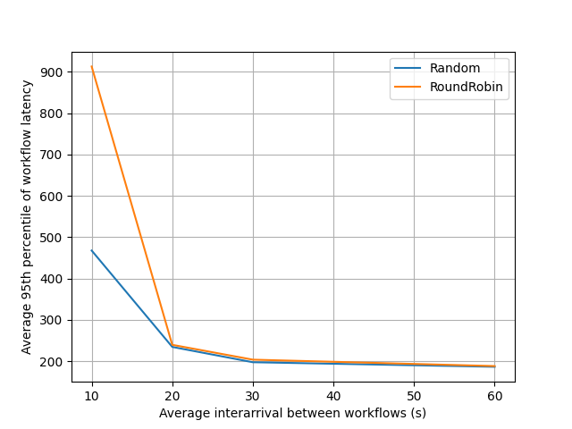

# 002-tid-benchmark-initial

## Scenario

- ε-ORC, ε-CON, Redis in a VM
- 5 nodes in other VMs:
  - 4 with 2 cores
  - 1 with 8 cores

Factors:
- load, in terms of the interarrival between consecutive workflows, with the
  average ranging from 10 s to 60 s
- orchestration policy, i.e., either `Random` or `RoundRobin`

Each experiment lasts 1 hour and is repeated 10 times.

Workload generated with `edgeless_benchmark`, see `run.sh` for the complete
set of parameters.

## Repeatability

1. Install a Redis server
2. Update the ε-ORC and ε-CON configuration in `conf/`
3. Install a cluster of EDGELESS nodes
4. Use `run.sh` to run experiments by saving the output data in `dataset`

## Dataset

The datasets can be downloaded with:

```shell
../../scripts/download-artifacts.sh
```

After download, the following script plots the average among the 95th percentile
of the workflow latency for all repetitions with a given orchestration policy
and interarrival time.

```shell
DATASET=dataset/application_metrics.csv python3 application_metrics.py
```

