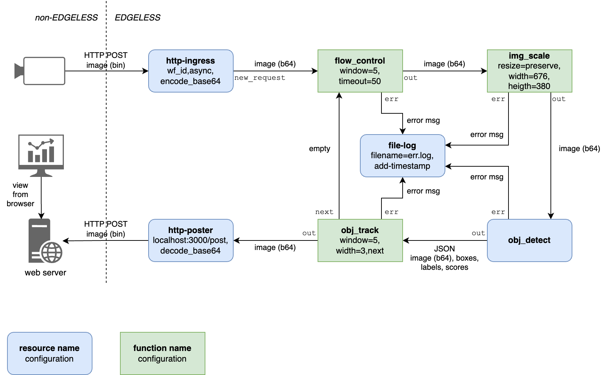

# 013-object_tracking

## Preliminary instructions

Download and build EDGELESS (see building instructions in that repo).
Make sure that `edgeless_inabox` and `edgeless_cli` can be executed, e.g.,
after building EDGELESS in release mode:

```shell
alias edgeless_cli=$PWD/target/release/edgeless_cli
alias edgeless_inabox=$PWD/target/release/edgeless_inabox
```

Build viewer from this repo:

```shell
cd viewer && cargo build --release && cd -
```

Build all WASM functions in this repo:

```shell
for f in rust_functions/* ; do
  cd $f
  edgeless_cli function build function.json
  cd -
done
```

## Image identification (test)

1. Shell A: `edgeless_inabox -t`
2. Shell A: `edgeless_inabox`
3. Shell B: `ID=$(edgeless_cli workflow start workflow-identify.json)`
4. Shell C: `viewer/target/release/viewer` (from root of this repo)
5. Shell D: `wget https://upload.wikimedia.org/wikipedia/commons/b/ba/Atlanta_75.85.jpg`
6. Shell D: `curl --data-binary @Atlanta_75.85.jpg "localhost:7007?wf_id=$ID"`
7. Shell B: `edgeless_cli workflow stop all`
8. From a browser check http://localhost:3000/
   - You should see a picture of a highway in Atlanta
9. Check the content of the file `info.log` in Shell A's working directory
   - You should see a single line ending with `{"width":2492,"height":1803}` 

## Object tracking

The workflow is illustrated in the diagram below and is representative of an IoT analytics application for augmenting a stream of real-time images captured from a camera: objects are identified in each frame, and their trajectories are added to the last frame.



The workflow includes both functions and resources.

Functions:

- `flow_control`, which regulates the rate of incoming frames to not overrun the capabilities of the hardware where heavy computation is happening;
- `img_scale`, which resizes the incoming images to fit the given sizes, while preserving the width/height ratio;
- `obj_track`, which receives the incoming image enriched with the objects identified in it and draws a bounding box around them; also, it keeps a memory of the last positions of the identified objects, to track them in the picture.

Resources:

- `http-ingress`, which is the entry point for the images captured by the camera;
- `file-log`, which saves to a local file the errors encountered, with a timestamp;
- `obj_detect,` which performs the detection of objects in a picture via an Ultralytics YOLO model running in a Docker container on the AGX Orin devices;
- `http-poster`, which sends the final image to an external web server for visualization.

This application showcases EDGELESS's ability to deploy stateful agents: the state consists of the objects detected in previous frames.

Steps to reproduce (first check the preliminary instructions above):

1. Shell A: `edgeless_inabox -t`
2. Modify the file `node.toml` by adding the following lines:

```ini
[[resources.serverless_provider]]
class_type = "obj_detect"
version = "0.1"
function_url = "http://localhost:5000"
provider = "obj_detect-1"
```

3. Shell A: `edgeless_inabox`
4. Shell B: install requirements and start the `obj_detect` serverless function:

```shell
cd openfaas_resources/obj_detect
python3 -m venv venv
source venv/bin/activate
pip install -r requirements.txt
python index.py
```

5. Shell C: `ID=$(edgeless_cli workflow start workflow-track.json)`
6. Shell D: `viewer/target/release/viewer` (from root of this repo)
8. Shell E: `wget https://upload.wikimedia.org/wikipedia/commons/b/ba/Atlanta_75.85.jpg`
9. Shell E: `curl --data-binary @Atlanta_75.85.jpg "localhost:7007?wf_id=$ID"`
10. Shell C: `edgeless_cli workflow stop all`
11. From a browser check http://localhost:3000/
   - You should see a picture of a highway in Atlanta with a bounding box
     drawn around some of the cars
