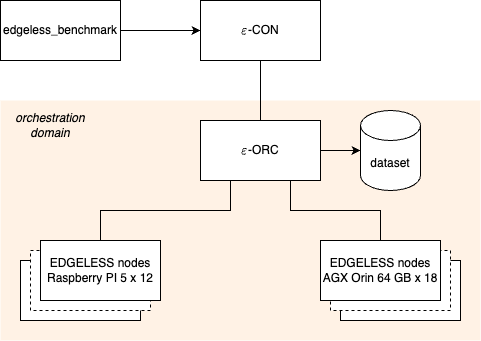
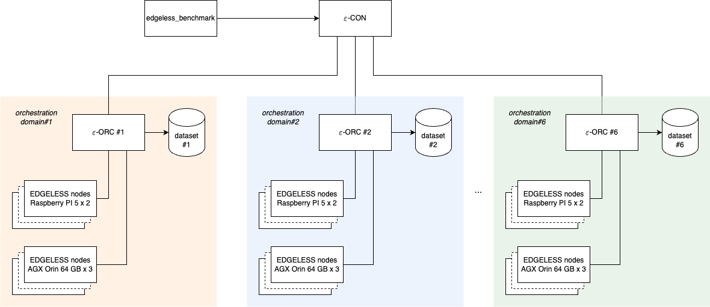
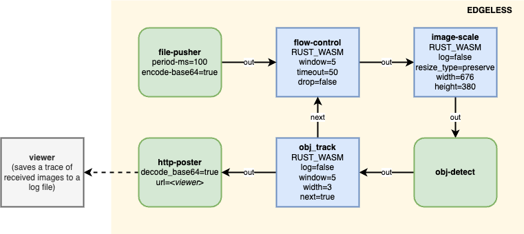

# 014-kpi3

## Scenarios

The baseline system is an EDGELESS cluster with a single orchestration domain
with which all the nodes are associated. In this setting, all the decisions are
made by the (single) ε-ORC of the orchestration domain, as the ε-CON does not
have any degree of freedom.

The target system is a decentralized deployment consisting of an EDGELESS
cluster with six orchestration domains, where decisions are made at two levels:
the ε-ORC manages its local resources in the domain with fine-grained
measurements, while the ε-CON manages function instances across clusters on a
longer time scale with aggregated measurements. All other conditions were the
same: benchmarking methodology, workload, applications, nodes’ resources, and
run-time environments, etc.

## Workflow

Components:

- The **file-pusher** resource is the workflow trigger. It casts one image to
  its output channel every 100 ms (framerate of 10 images/s), encoded with
  base64. The images are read from a dataset in the local filesystem. A public
  dataset of images has been used in the experiment, with pictures taken from
  a public road.
- The **flow-control** WebAssembly stateless function regulates the pace of
  messages allowing up to 5 images to be in flight at the same time, with a
  reset timeout after 50 input images; images exceeding the rate are silently
  dropped.
- The **image-scale** WebAssembly stateless function enforces a maximum
  width/height of 676/380 pixels in the incoming images by rescaling them, as 
  needed, while preserving the width : height ratio.
- The **obj-detect** resource perform object detection on each incoming image,
  by adding the position, size, and type of objects found as metadata to the
  output message. Object detection is performed via YOLO using an
  [ultralytics](https://www.ultralytics.com/) container made for the NVIDIA
  AGX Orin boards.
- The **obj_track** WebAssembly stateful function performs tracking of objects
  by looking at the previous 5 images and adding a bounding box and trajectory
  to the output image.
- The **http-poster** resource performs a base64 decoding and sends the
  received image to an external service via an HTTP post.
- The external service, called viewer in the diagram below, is a simple web
  browser implemented in Rust which tracks the received images and produces a
  timestamped log.

## Workload

The workload has been created by the edgeless_benchmark utility, part of the
core EDGELESS repository, with the following configuration:
- Duration of the experiment: 1800 s.
- Random workflow duration distributed according to a Poisson distribution
  with average  60 s, 120 s, or 240 s.
- Interarrival of workflows distributed according to a Poisson distribution,
  with average interarrival 2 s. This holds a workload of 30, 60, or 120
  concurrently active applications.

## Testbed

The experiments have been run at CNR-IIT facilities operated by the
[Ubiquitous Internet research group](https://ui.iit.cnr.it/en/).

The ε-CON has been deployed to a dedicated container in a proxmox cluster and
has not been restarted across experiments. The edgeless_benchmark executed in
the same container.
The ε-ORC services have been deployed each to a dedicated container in the same
proxmox cluster; the Redis proxy was enabled in each, with the dataset dumping
feature for post-process analysis.
The EDGELESS nodes have been deployed to Raspberry PI 5 and NVIDIA AGX Orin 64
GB devices. The refresh interval towards the ε-ORC was set to 10 s, and the
acquisition of performance samples was enabled.
All the nodes have been configured with:
- The RUST_WASM run-time.
- A http-poster resource provider.
- A file-pusher resource provider, with a local dataset of images (the same
  for all the nodes).

The obj-detect serverless resource has been installed and enabled only on the
Orin devices.
The power consumption metrics have been acquired by Raritan PDUs, with
individual monitoring of the active power of outlets to which the EDGELESS
nodes were connected.
The nodes are interconnected by Cisco L2 switches via 1 GbE (Raspberry PI 5
nodes) and 10 GbE (AGX Orin 64 GB nodes) ports.

## Results

The plots are available in the directory `plots/`, produced by the script
`analyze.py` in this directory.

Reproducing the plots requires downloading the dataset from
[Zenodo](https://zenodo.org/records/18613337).